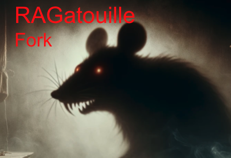

# RAGatouille-Fork
Fork created and maintained by Carlo Siebenschuh and Brian Hsu.
<p align="center"></p>

---

Dense retrieval, i.e. using embeddings such as OpenAI's `text-ada-002`, is a good baseline, but there's a lot of research [showing dense embeddings might not be the](https://arxiv.org/abs/2104.08663) [best fit for **your** usecase](https://arxiv.org/abs/2204.11447).

Information retrieval (IR) field with models like ColBERT have been shown promise. [generalise better](https://arxiv.org/abs/2203.10053) [to new or complex domains](https://aclanthology.org/2022.findings-emnlp.78/) [than dense embeddings](https://arxiv.org/abs/2205.02870), are [ridiculously data-efficient](https://arxiv.org/abs/2309.06131) and are even [better suited to efficiently being trained](https://arxiv.org/abs/2312.09508) [on non-English languages with low amount of data](https://arxiv.org/abs/2312.16144)! 

### RAGatouille
State-of-the-art methods for RAG pipelines. Currently, RAGatouille focuses on making ColBERT simple to use.

_Motivation, philosophy, and how ColBERT works: [introduction in the docs](https://ben.clavie.eu/ragatouille/)_


⚠️ Running notes/requirements: ⚠️
- If running inside a script, you must run it inside `if __name__ == "__main__"`

## Key resources

- [🚀 Training and Fine-Tuning ColBERT models](#-training-and-fine-tuning)
- [🗄️ Embedding and Indexing Documents](#%EF%B8%8F-indexing)
- [🔎 Retrieving documents](#-retrieving-documents)
➡️ [Fully functional code example](https://github.com/bclavie/RAGatouille/tree/main/examples)⬅️

### 🚀 Training and fine-tuning

Pretrained models are are available via [ColBERTv2](https://huggingface.co/colbert-ir/colbertv2.0) that has shown [good performanceg](https://arxiv.org/abs/2303.00807) at zero-shot retrieval in new domains!

#### Data Processing

RAGatouille's RAGTrainer has a built-in `TrainingDataProcessor`, which can take most forms of retrieval training data, and **automatically convert it to training triplets**, with data enhancements. The pipeline works as follows:

- accepts pairs/labelled pairs/various forms of triplets as inputs (strings or list of strings)
- automatically remove all duplicates and maps all positives/negatives to their respective query.
- **by default, mine hard negatives**: this means generating negatives that are hard to distinguish from positives, and that are therefore more useful for training.

This is all handled by `RAGTrainer.prepare_training_data()`, and is as easy as doing passing your data to it:

```python
from ragatouille import RAGTrainer

my_data = [
    ("What is the meaning of life ?", "The meaning of life is 42"),
    ("What is Neural Search?", "Neural Search is a terms referring to a family of ..."),
    ...
]  # Unlabelled pairs here
trainer = RAGTrainer()
trainer.prepare_training_data(raw_data=my_data)
```

ColBERT prefers to store processed training data on-file, which also makes easier to properly version training data via `wandb` or `dvc`. By default, it will write to `./data/`, but you can override this by passing a `data_out_path` argument to `prepare_training_data()`.

Just like all things in RAGatouille, `prepare_training_data` uses strong defaults, but is also fully parameterizable.
<!-- Check out the [Data Processing](https://ben.clavie.eu/ragatouille/data-processing) section of the docs! -->

#### Running the Training/Fine-Tuning

Training and Fine-Tuning follow the same process. When you instantiate `RAGTrainer`, you must pass it a `pretrained_model_name`. If this pretrained model is a ColBERT instance, the trainer will be in fine-tuning mode, if it's another kind of transformer, it will be in training mode to begin training a new ColBERT initialised from the model's weights!


```python
from ragatouille import RAGTrainer
from ragatouille.utils import get_wikipedia_page

pairs = [
    ("What is the meaning of life ?", "The meaning of life is 42"),
    ("What is Neural Search?", "Neural Search is a terms referring to a family of ..."),
    # You need many more pairs to train! Check the examples for more details!
    ...
]

my_full_corpus = [get_wikipedia_page("Hayao_Miyazaki"), get_wikipedia_page("Studio_Ghibli")]


trainer = RAGTrainer(model_name = "MyFineTunedColBERT",
        pretrained_model_name = "colbert-ir/colbertv2.0") # In this example, we run fine-tuning

# This step handles all the data processing, check the examples for more details!
trainer.prepare_training_data(raw_data=pairs,
                                data_out_path="./data/",
                                all_documents=my_full_corpus)

trainer.train(batch_size=32) # Train with the default hyperparams
```

When you run `train()`, it'll by default inherit its parent ColBERT hyperparameters if fine-tuning, or use the default training parameters if training a new ColBERT. Feel free to modify them as you see fit (check the example and API reference for more details!)


### 🗄️ Indexing

To create an index, you'll need to load a trained model, this can be one of your own or a pretrained one from the hub! Creating an index with the default configuration is just a few lines of code:

```python
from ragatouille import RAGPretrainedModel
from ragatouille.utils import get_wikipedia_page

RAG = RAGPretrainedModel.from_pretrained("colbert-ir/colbertv2.0")
my_documents = [get_wikipedia_page("Hayao_Miyazaki"), get_wikipedia_page("Studio_Ghibli")]
index_path = RAG.index(index_name="my_index", collection=my_documents)
```
You can also optionally add document IDs or document metadata when creating the index:

```python
document_ids = ["miyazaki", "ghibli"]
document_metadatas = [
    {"entity": "person", "source": "wikipedia"},
    {"entity": "organisation", "source": "wikipedia"},
]
index_path = RAG.index(
    index_name="my_index_with_ids_and_metadata",
    collection=my_documents,
    document_ids=document_ids,
    document_metadatas=document_metadatas,
)
```

Once this is done running, your index will be saved on-disk and ready to be queried! RAGatouille and ColBERT handle everything here:
- Splitting your documents
- Tokenizing your documents
- Identifying the individual terms
- Embedding the documents and generating the bags-of-embeddings
- Compressing the vectors and storing them on disk

Curious about how this works? Check out the [Late-Interaction & ColBERT concept explainer](https://ben.clavie.eu/ragatouille/#late-interaction)
<!-- or find out more about [indexing](https://ben.clavie.eu/ragatouille/indexing)! -->

## Document retrieval

Once an index is created, querying it is just as simple as creating it! You can either load the model you need directly from an index's configuration:

```python
from ragatouille import RAGPretrainedModel

query = "ColBERT my dear ColBERT, who is the fairest document of them all?"
RAG = RAGPretrainedModel.from_index("path_to_your_index")
results = RAG.search(query:List[str]|str, k:int=10)
```

This is the preferred way of doing things, since every index saves the full configuration of the model used to create it, and you can easily load it back up.

`RAG.search` is a flexible method! You can set the `k` value to however many results you want (it defaults to `10`), and you can also use it to search for multiple queries at once:

```python
RAG.search(["What manga did Hayao Miyazaki write?",
"Who are the founders of Ghibli?"
"Who is the director of Spirited Away?"],)
```

`RAG.search` returns results in the form of a list of dictionaries, or a list of list of dictionaries if you used multiple queries: 

```python
# single-query result
[
    {"content": "blablabla", "score": 42.424242, "rank": 1, "document_id": "x"},
    ...,
    {"content": "albalbalba", "score": 24.242424, "rank": k, "document_id": "y"},
]
# multi-query result
[
    [
        {"content": "blablabla", "score": 42.424242, "rank": 1, "document_id": "x"},
        ...,
        {"content": "albalbalba", "score": 24.242424, "rank": k, "document_id": "y"},
    ],
    [
        {"content": "blablabla", "score": 42.424242, "rank": 1, "document_id": "x"},
        ...,
        {"content": "albalbalba", "score": 24.242424, "rank": k, "document_id": "y"},
    ],
 ],
```
If your index includes document metadata, it'll be returned as a dictionary in the `document_metadata` key of the result dictionary:
    
```python
[
    {"content": "blablabla", "score": 42.424242, "rank": 1, "document_id": "x", "document_metadata": {"A": 1, "B": 2}},
    ...,
    {"content": "albalbalba", "score": 24.242424, "rank": k, "document_id": "y", "document_metadata": {"A": 3, "B": 4}},
]
```

## How can one integrate late-interaction RAG into my project?

RAGatouille bundles everything you need to build a ColBERT native index and query it. RAGatouille persists indices on disk in compressed format $\rightarrow$ simply integrate the index you need into your project and query it directly. 

See Spotify announcement: _[Spotify Voyager](https://engineering.atspotify.com/2023/10/introducing-voyager-spotifys-new-nearest-neighbor-search-library/)_


### Integrations

If you'd like to use more than RAGatouille, ColBERT has a growing number of integrations, and they all fully support models trained or fine-tuned with RAGatouille!

- The [official ColBERT implementation](https://github.com/stanford-futuredata/ColBERT) has a built-in query server (using Flask), which you can easily query via API requests and does support indexes generated with RAGatouille! This should be enough for most small applications, so long as you can persist the index on disk.
- [Vespa](https://vespa.ai) offers a fully managed RAG engine with ColBERT support: it's essentially just like a vector DB, except with many more retrieval options! Full support for ColBERT models will be released in the next couple weeks, and using a RAGatouille-trained model will be as simple as loading it from the huggingface hub! **Vespa is a well-tested, widely used framework and is [fully-supported in LangChain](https://python.langchain.com/docs/integrations/providers/vespa), making it the ideal slot-in replacement to replace your current RAG pipeline with ColBERT!**
- [Intel's FastRAG](https://github.com/IntelLabs/fastRAG) supports ColBERT models for RAG, and is fully compatible with RAGatouille-trained models.
- [LlamaIndex](https://www.llamaindex.ai) is building ColBERT integrations and already [has early ColBERT support, with active development continuing](https://github.com/run-llama/llama_index/pull/9656).
